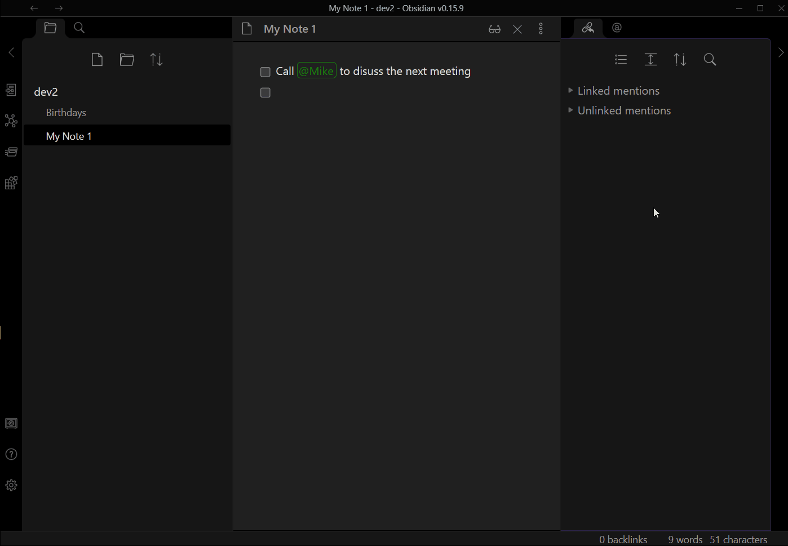
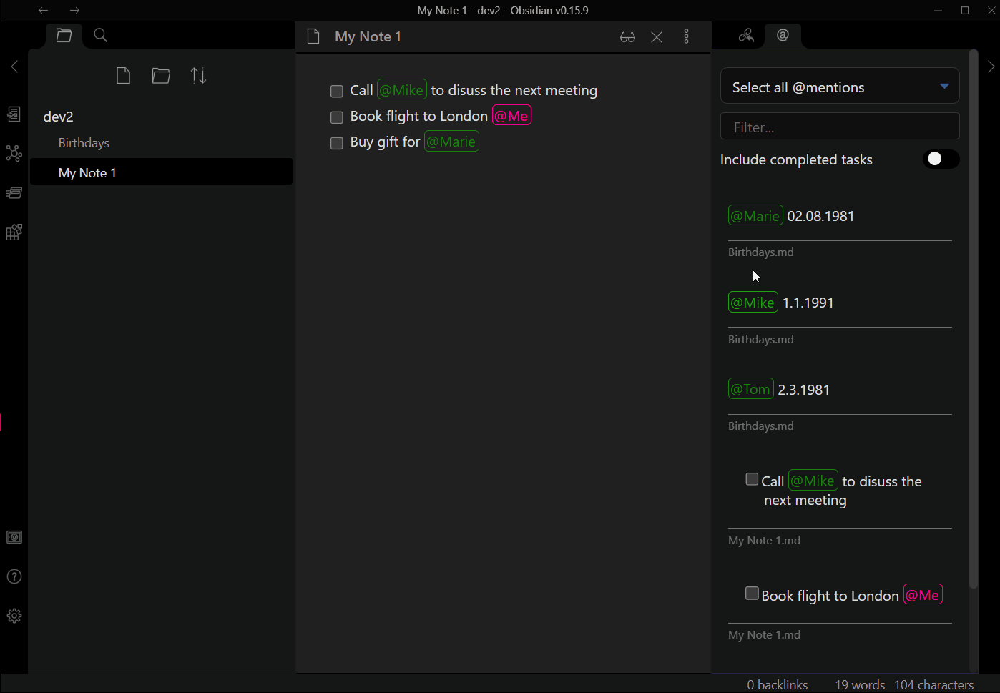
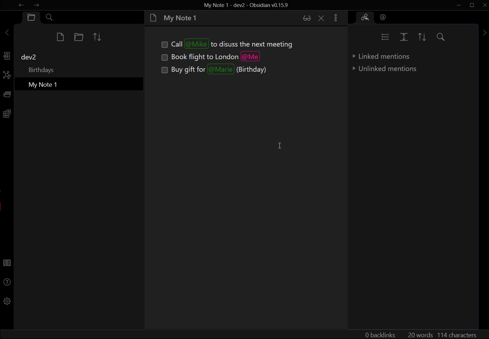
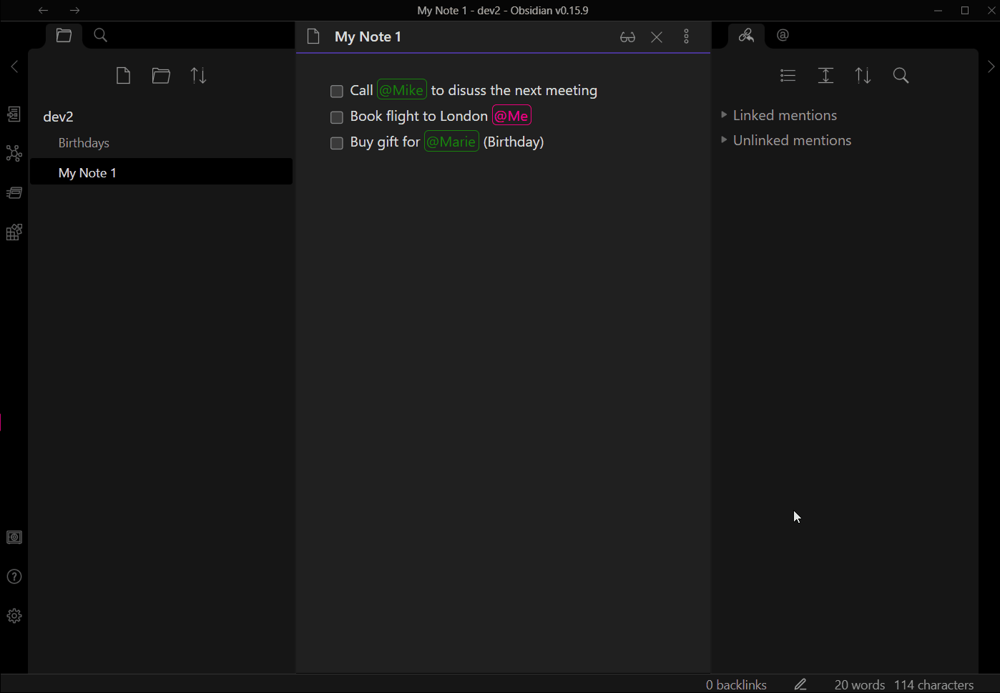

# Obsidian simple mention
A simple plugin that visually highlights mentions and suggests existing ones as you write.   
The mention prefix can be customized and defaults to `@`.  
Find all occurrences of a mention in the side pane and jump to the corresponding line in the document.  
Distinguish your personal mentions from the others by a different color.

Filter your mentions by a phrase

## Settings
You can set:
- the trigger phrase (@)
- the color of the mentions (green)
- the color of your own mentions (deeppink)
- the name, how you want to mention yourself (Me)

## Shortcuts
### In edit mode
`ctrl+space` or `ctrl+click` on a mention, opens the right side pane with all occurrences of that mention.

### In preview mode
When you click on a mention, the right side pane opens with all occurrences of that mention.

## Known issues
- We need to restart Obsidian after adjusting the trigger phrase for the changes to take effect.
- We need to restart Obsidian after changing the name of yourself for the changes to take effect.
- Style could currently not be overridden by a template (simple fix)

## Ideas
- Group mentions
  - eg. @group-x(@bob,@lisa)
  - usage: find all mentions of @bob and @lisa by searching for @group-x
- Multi select of mentions in the view
- Mark filterphrase in the view
- Show sub bullet points
- own color for each "person"